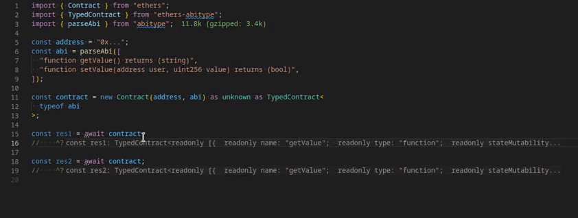

</br>

<h1 align="center">ethers.js + abitype</h1>
<p align="center">
  Improves <a href="https://github.com/ethers-io/ethers.js">ethers.js</a> with strict ABI typing
<p>

<p align="center">
  
</p>

---

Makes <a href="https://github.com/ethers-io/ethers.js">ethers.js</a> much better. Adds strict typing for Contract class based on ABI using the [abitype](https://github.com/wevm/abitype) library.
For those who like this feature in [viem](https://github.com/wevm/viem), but not viem itself.

## Installation

```bash
npm i ethers-abitype
```

## Usage

The library provides a special type for the Contract class and in your code you only need to override the type

Example without ABI typing (your regular ethers.js code):

```typescript
import { Contract } from "ethers";

const address = "0x...";
const abi = [
  /*..*/
];

const contract = new Contract(address, abi);
```

Example code with ABI typing:

```diff
import { Contract } from "ethers";
+ import { TypedContract } from "ethers-abitype";

const address = "0x...";
const abi = [
  /*..*/
- ];
+ ] as const;

- const contract = new Contract(address, abi);
+ const contract = new Contract(address, abi) as unknown as TypedContract<typeof abi>;
```

Congratulations, you now have a typed contract!

Alternatively, the library provides another approach. You can use a small wrapper function for creating an already typed contract:

```diff
- import { Contract } from "ethers";
+ import { typedContract } from "ethers-abitype";

const address = "0x...";
const abi = [
  /*..*/
- ];
+ ] as const;

- const contract = new Contract(address, abi);
+ const contract = typedContract(address, abi);
```

> **Important!** Your ABI must be declared using a [const assertion](https://www.typescriptlang.org/docs/handbook/release-notes/typescript-3-4.html#const-assertions). This means that you will not be able to store them in a JSON file, because [TypeScript doesn't support importing JSON as const](https://github.com/microsoft/TypeScript/issues/32063)

You can also use [Human-Readable ABI](https://blog.ricmoo.com/human-readable-contract-abis-in-ethers-js-141902f4d917?gi=a7bc6a9be301) using [`parseAbi`](https://abitype.dev/api/human#parseabi-1) from `abitype`:

```typescript
import { typedContract } from "ethers-abitype";
import { parseAbi } from "abitype";

const address = "0x...";
const abi = parseAbi([
  "function symbol() external returns (string)",
  "function decimals() external returns (uint256)",
  /* ... */
]);

const contract = typedContract(address, abi);
```
